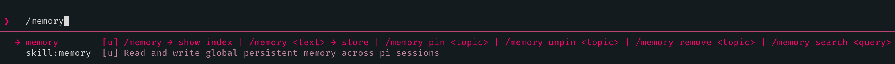
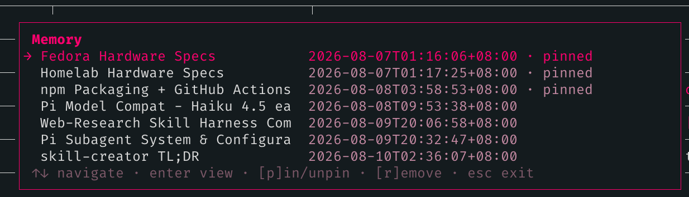

# openpi-memory

[](https://www.npmjs.com/package/@openlines/openpi-memory)
[](./LICENSE)

Global persistent memory for [pi coding agent](https://pi.dev) sessions. **Open. Configurable.** Inspired by Claude Code's auto-memory — your agent remembers what it learns, across every session, globally.

A port of [openclaude-memory](https://github.com/linellazatin/openclaude-memory) to pi's extension API.

> Considering that vast majority of people who use **pi** literally creates their own extensions, I'm shooting my shot on this memory extension that I believe is good enough to be your *ultra-simplest* memory handler.

>
> ## v0.3.1 HOTFIX on shared_dir
> - **`shared_dir` carry-over now merges** instead of skipping when the shared dir already has content from another memory system of ours (e.g. openpi-memory wrote first) — collisions resolved by content comparison, differing files get a `-opim` suffix
>
> ## v0.3.0 - MAJOR structural change
> - `shared_dir` now a thing in the [config](docs/configuration.md#memoryjsonc) - you can opt-in on putting your memory entries (and index) to ~/.agents/memory and be SHARED between our "openlines" (lol) memory handlers for opencode ([openclaude-memory](https://github.com/linellazatin/openclaude-memory)) *(still on planning stages - to follow updates)* & pi coding agent ([openpi-memory](https://github.com/linellazatin/openpi-memory)); opting out (toggling to false) would just fallback to using our original ~/.pi/agent/memory for index and entries, but would still use the memory.jsonc config file starting this `0.3.0`.
> - opting-in to `shared_dir` is somehow 'seamless' - see [FAQs](docs/faq.md).
> - starting this version, the `HANDOFF` file is now living in `AGENT_DIR` (same level as memory.jsonc config file)
>
> ```
> and guys, sorry for multiple (MAJOR) structural modifications - all of these just came flashing into my brain, and I can't help but OBEY my mind! 
> ```
> see [CHANGELOG](CHANGELOG.md) for more details

## Table of contents

- [Why](#why)
- [How it works](#how-it-works)
- [Tools](#tools)
- [/memory command](#memory-command)
- [Install/Update/Uninstall](#install)

**Docs — deeper dives, not needed to get started:**

- [How pi Handles Memory Injection](docs/memory-injection.md) — why injection is scheduled, not persistent, and what that means for what the agent sees each turn
- [Shared Storage Across Tools (shared_dir)](docs/shared-directory.md) — the opt-in `~/.agents/memory/` migration, fresh-install and upgrade walkthroughs
- [Compaction Handoff & Auto-Resume](docs/features.md) — resuming work across context compaction
- [Configuration & Index Reference](docs/configuration.md) — full `memory.jsonc` reference, index format, stale flagging, maintenance
- [Architecture & Internals](docs/architecture.md) — hooks, model compatibility, token overhead, dev setup
- [Known Limitations & FAQ](docs/faq.md) — watch-outs, especially around `shared_dir` toggling

## Why

I built this because I genuinely like how Claude Code handles memory: no complex algorithms, no external LLM for heavy lifting, no vector databases. It just works — the agent reads a markdown file and acts on it. Simple, transparent, effective.

I also wanted something local-first. My memories and notes stay on my machine, in plain markdown files I can read, edit, and audit at any time. No cloud sync, no embeddings pipeline, no black-box retrieval. If I want to know what the agent remembers, I open a file.

When something worth remembering happens (a bug fixed, user preferences, a config discovered, a command identified), the agent writes it to a structured markdown memory store — or you tell it to. The next session, that context is already there — injected automatically into the system prompt before the first message.

But this project wasn't born because I wanted to reinvent memory systems. It was born out of frustration.

Over the past several months, I experimented with nearly every approach I could find: vector databases, embedding models, external memory services, MCP memory servers, and LLM-powered memory management. Some were incredibly clever. Some were feature-rich. But almost all of them came with trade-offs that didn't fit how I work.

Running a separate LLM just to decide whether a memory should be saved felt wasteful. Maintaining embedding models and vector indexes consumed resources I'd rather dedicate to the coding model itself. I found myself spending more time configuring the memory system than actually using it.

I also discovered that more intelligence didn't always mean better memory. During my own testing, I audited memories produced by automated systems and found that many retained facts were incomplete, misleading, or simply wrong. If the memory layer itself isn't trustworthy, every future conversation starts from a weaker foundation.

Eventually I asked myself a simple question:

> Why does remembering something require another AI model?

For the kinds of things I actually wanted to remember — project architecture, debugging notes, shell commands, configuration quirks, design decisions — the answer was: it doesn't.

A markdown file is deterministic. It's searchable with Git. It can be reviewed in code reviews. It survives model changes, provider changes, and framework changes. Most importantly, it never hides what the agent knows.

So instead of building another "AI memory," I built a memory system that stays out of the way.

- No embeddings.
- No vector databases.
- No background services.
- No hidden retrieval algorithms.

Just files, structure, and an agent that knows where to look.

> If you've ever spent hours configuring a sophisticated memory stack only to realize you just wanted your coding agent to remember yesterday's bug fix, this project is for you.

## How it works

```
~/.pi/agent/memory/          # or ~/.agents/memory/ if shared_dir: true
├── MEMORY.md              # index — injected into every session automatically
└── <topic>.md             # per-topic detail files, created by write_memory

~/.pi/agent/memory.jsonc    # persist rules + config — always per-tool, never shared
~/.pi/agent/HANDOFF.md      # compaction handoff entries (auto-managed, always local)
```

All files are plain text. You can read, edit, and delete them at any time. The default location respects `PI_CODING_AGENT_DIR` if set (pi's config-dir override).

`MEMORY.md` is the index that gets injected into the system prompt. Each entry points to a topic file. Topic files hold the full content — they are read on-demand, not injected wholesale. `memory.jsonc` holds your persist rules and config scalars. `HANDOFF.md` is managed automatically by the compaction handoff feature.

On the first user prompt of each session, `MEMORY.md` and the rendered rules from `memory.jsonc` are injected into the system prompt. They are re-injected every `inject_every_n_turns` prompts thereafter (default: 5). After context compaction, injection state resets so the very next prompt always re-injects.

See [Shared Storage Across Tools (shared_dir)](docs/shared-directory.md) for the opt-in cross-tool shared directory, and fresh-install / upgrade walkthroughs. See [How pi Handles Memory Injection](docs/memory-injection.md) for why injection is scheduled rather than persistent.

## Tools

The extension registers three tools the agent uses for all memory operations:

| Tool            | Args                                           | What it does                                                        |
| --------------- | ---------------------------------------------- | ------------------------------------------------------------------- |
| `write_memory`  | `topic`, `content`, `summary`, `pin?`, `mode?` | Creates or appends/replaces a topic file; upserts `MEMORY.md` index |
| `remove_memory` | `topic`                                        | Removes the index entry (refuses if pinned); topic file preserved   |
| `pin_memory`    | `topic`, `pin` (bool)                          | Pins or unpins an index entry                                       |

`mode: "replace"` replaces the full topic body in-place (frontmatter preserved, `last_updated` refreshed). Use for state entries that should be current — hardware specs, environment config, user preferences. Default (`"append"`) appends under a dated heading, correct for logs of fixes, discoveries, and incremental notes. `overwrite: true` is a backwards-compatible alias for `mode: "replace"`.

Use these instead of asking the agent to edit files directly — they guarantee correct format, frontmatter, and index integrity regardless of model size.

## `/memory` command



```
/memory                    → open interactive memory browser
/memory <text>             → store something (agent picks topic, summary, pin)
/memory consolidate        → scan conversation; write undocumented facts + session recap
/memory pin <topic>        → pin an entry
/memory unpin <topic>      → unpin an entry
/memory remove <topic>     → remove an index entry
/memory search <query>     → search index and topic bodies; opens browser filtered to matches
```

**`/memory` (no args)** opens a navigable overlay browser — this is the primary way to pin/unpin and remove entries:



- **List view** — all topics with date and pin/stale status. `↑↓` to navigate, `enter` to open a topic, `[p]` to pin/unpin the highlighted entry in-place, `[r]` to remove, `esc` to close. Selection position is preserved across pin/unpin, remove, and detail-view round-trips.
- **Detail view** — Markdown-rendered topic body (capped at 6 lines; longer entries show a `… N more lines (filename.md)` indicator), metadata, and an action list: Pin/Unpin, Remove, Back. `[p]` and `[r]` hotkeys work here too. Remove asks for confirmation. Any action or `esc` returns to the list.


**`/memory <text>`** sends the text to the agent with an instruction to call `write_memory`. The agent decides the topic name, filename, summary, and whether to pin it.

**`/memory pin/unpin/remove <topic>`** are a chat-input fallback for when you already know the topic name and want to skip opening the browser. They run directly in the command handler — no LLM round-trip.

**`/memory search <query>`** does a case-insensitive substring search across the index (name, filename, summary) and all topic file bodies. Matching entries open in the full interactive browser — same pin/unpin, remove, and detail view as `/memory`. No LLM round-trip.

**`/memory consolidate`** sends a structured prompt to the agent asking it to scan the current conversation history and call `write_memory` for each fact, decision, discovery, config detail, or technical learning not yet in the index. As a final step, the agent writes a `last-session-recap` entry (`mode: replace`) — a 3–5 sentence narrative of what was accomplished this session. That recap entry is injected into the system prompt at the start of the next session, orienting the agent without requiring the user to re-explain context.

When triggered via `consolidate_on_compact`, the extension feeds pi's already-generated compaction summary directly to the agent instead of asking it to re-scan the full conversation — saving one LLM scan turn. When invoked manually via `/memory consolidate`, the agent scans the live conversation history.

Cost: one LLM round-trip (extraction only when via compaction; scan + extract when manual). Use at natural breakpoints — before closing a long session, before switching contexts, or any time you want the session's learnings captured. Enable `consolidate_on_compact: true` in `memory.jsonc` to run consolidation automatically after threshold compaction.

See [Compaction Handoff & Auto-Resume](docs/features.md) for how the extension helps the agent resume work across context compaction.

## Install

```bash
pi install npm:@openlines/openpi-memory
```

Or from git:

```bash
pi install git:github.com/linellazatin/openpi-memory
```

The extension and skill load automatically after install. No further setup.

## Update

```bash
pi update npm:@openlines/openpi-memory
```

To update all installed packages at once:

```bash
pi update --extensions
```
or just always do ` --all` for convenience

Versioned installs (e.g. `npm:@openlines/openpi-memory@1.0.0`) are pinned and skipped by `--extensions`. Use `pi install npm:@openlines/openpi-memory@new-version` to move to a specific version.

## Uninstall

```bash
pi remove npm:@openlines/openpi-memory
```

This removes the package from pi's settings. It does not touch your memory files — `~/.pi/agent/memory/` is left intact so nothing is lost. Delete that directory manually if you want to clear stored memories.

## License

MIT
