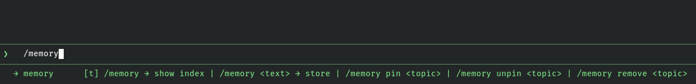
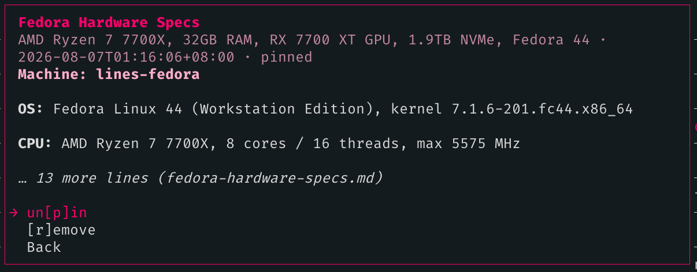

# openpi-memory

[](https://www.npmjs.com/package/@openlines/openpi-memory)
[](./LICENSE)

Global persistent memory for [pi coding agent](https://pi.dev) sessions. **Open. Configurable.** Inspired by Claude Code's auto-memory — your agent remembers what it learns, across every session, globally.

A port of [openclaude-memory](https://github.com/linellazatin/openclaude-memory) to pi's extension API.

> Considering that vast majority of people who use **pi** literally creates their own extensions, I'm shooting my shot on this memory extension that I believe is good enough to be your *ultra-simplest* memory handler.

## Why

I built this because I genuinely like how Claude Code handles memory: no complex algorithms, no external LLM for heavy lifting, no vector databases. It just works — the agent reads a markdown file and acts on it. Simple, transparent, effective.

I also wanted something local-first. My memories and notes stay on my machine, in plain markdown files I can read, edit, and audit at any time. No cloud sync, no embeddings pipeline, no black-box retrieval. If I want to know what the agent remembers, I open a file.

When something worth remembering happens (a bug fixed, user preferences, a config discovered, a command identified), the agent writes it to a structured markdown memory store — or you tell it to. The next session, that context is already there — injected automatically into the system prompt before the first message.

But this project wasn't born because I wanted to reinvent memory systems. It was born out of frustration.

Over the past several months, I experimented with nearly every approach I could find: vector databases, embedding models, external memory services, MCP memory servers, and LLM-powered memory management. Some were incredibly clever. Some were feature-rich. But almost all of them came with trade-offs that didn't fit how I work.

Running a separate LLM just to decide whether a memory should be saved felt wasteful. Maintaining embedding models and vector indexes consumed resources I'd rather dedicate to the coding model itself. I found myself spending more time configuring the memory system than actually using it.

I also discovered that more intelligence didn't always mean better memory. During my own testing, I audited memories produced by automated systems and found that many retained facts were incomplete, misleading, or simply wrong. If the memory layer itself isn't trustworthy, every future conversation starts from a weaker foundation.

Eventually I asked myself a simple question:

> Why does remembering something require another AI model?

For the kinds of things I actually wanted to remember — project architecture, debugging notes, shell commands, configuration quirks, design decisions — the answer was: it doesn't.

A markdown file is deterministic. It's searchable with Git. It can be reviewed in code reviews. It survives model changes, provider changes, and framework changes. Most importantly, it never hides what the agent knows.

So instead of building another "AI memory," I built a memory system that stays out of the way.

- No embeddings.
- No vector databases.
- No background services.
- No hidden retrieval algorithms.

Just files, structure, and an agent that knows where to look.

> If you've ever spent hours configuring a sophisticated memory stack only to realize you just wanted your coding agent to remember yesterday's bug fix, this project is for you.

## How pi handles memory injection

Understanding this is important before configuring or depending on memory behavior.

### pi does not have a persistent system prompt

In pi, there is no mechanism to inject content once at session start and have it remain visible for the entire session. Every turn, pi constructs the system prompt from scratch. Content that is not re-injected on a given turn is **not present in the system prompt for that turn's LLM call**.

This is fundamentally different from tools like opencode, where `system.transform` fires on every internal LLM call and can maintain a persistent block throughout a session.

### How this extension works around it

This extension uses pi's `before_agent_start` hook, which fires **once per user prompt**. On each firing, the hook decides whether to append `## Global Memory` (the MEMORY.md index) and `## Memory Rules` to the system prompt for that turn.

The injection schedule:

```
Turn 1            → inject  (first prompt of session)
Turns 2, 3, 4     → skip
Turn 5            → inject  (every inject_every_n_turns, default 5)
Turns 6, 7, 8, 9  → skip
Turn 10           → inject
…
```

On skipped turns, `## Global Memory` is **absent from the system prompt entirely**. The agent relies on what it already read and processed from the most recent injected turn — it is not re-reading the index, it is working from its own context window recall.

### What this means in practice

- **The agent may not see index updates immediately.** If a topic is written via `write_memory` on turn 3, the updated index is not injected until turn 5. The agent knows about it because it made the write — but a fresh read of the index won't appear in the system prompt until the next scheduled injection.

- **Between injections, memory is not explicitly in context.** The agent can still act on memories it recalls from earlier in the conversation, but the index is not actively present in the system prompt on every turn.

- **Set `inject_every_n_turns: 1` if you need the index always visible.** This injects on every user prompt. The cost is ~265 tokens of fixed overhead plus ~35 tokens per index entry on every turn — see [Token overhead](#token-overhead) below.

- **Context compaction resets injection.** When context is compacted (`session_before_compact`), the injection state resets so the first turn after compaction always re-injects, regardless of where the turn counter was. The compaction handoff (if enabled) is also injected on that first post-compaction turn.

- **`session_start` does not inject anything.** It only bootstraps the memory directory and files if they are missing, and resets the injection state flags. No content reaches the LLM at session start.

### Why not inject on every turn by default?

Token cost. At 200 index entries, a single injection is ~7,000+ tokens. At `inject_every_n_turns: 5`, that cost is amortized across 5 turns. See [Token overhead](#token-overhead) for a full breakdown and the savings table.

## How it works

```
~/.pi/agent/memory/
├── MEMORY.md              # index — injected into every session automatically
├── RULES.jsonc            # persist rules + config
├── HANDOFF.md             # compaction handoff entries (auto-managed)
└── <topic>.md             # per-topic detail files, created by write_memory
```

All files are plain text. You can read, edit, and delete them at any time. The default location respects `PI_CODING_AGENT_DIR` if set (pi's config-dir override).

`MEMORY.md` is the index that gets injected into the system prompt. Each entry points to a topic file. Topic files hold the full content — they are read on-demand, not injected wholesale. `RULES.jsonc` holds your persist rules and config scalars. `HANDOFF.md` is managed automatically by the compaction handoff feature.

On the first user prompt of each session, `MEMORY.md` and the rendered rules from `RULES.jsonc` are injected into the system prompt. They are re-injected every `inject_every_n_turns` prompts thereafter (default: 5). After context compaction, injection state resets so the very next prompt always re-injects.

## Tools

The extension registers three tools the agent uses for all memory operations:

| Tool            | Args                                           | What it does                                                        |
| --------------- | ---------------------------------------------- | ------------------------------------------------------------------- |
| `write_memory`  | `topic`, `content`, `summary`, `pin?`, `mode?` | Creates or appends/replaces a topic file; upserts `MEMORY.md` index |
| `remove_memory` | `topic`                                        | Removes the index entry (refuses if pinned); topic file preserved   |
| `pin_memory`    | `topic`, `pin` (bool)                          | Pins or unpins an index entry                                       |

`mode: "replace"` replaces the full topic body in-place (frontmatter preserved, `last_updated` refreshed). Use for state entries that should be current — hardware specs, environment config, user preferences. Default (`"append"`) appends under a dated heading, correct for logs of fixes, discoveries, and incremental notes. `overwrite: true` is a backwards-compatible alias for `mode: "replace"`.

Use these instead of asking the agent to edit files directly — they guarantee correct format, frontmatter, and index integrity regardless of model size.

## `/memory` command



```
/memory                    → open interactive memory browser
/memory <text>             → store something (agent picks topic, summary, pin)
/memory pin <topic>        → pin an entry
/memory unpin <topic>      → unpin an entry
/memory remove <topic>     → remove an index entry
/memory search <query>     → search index and topic bodies; opens browser filtered to matches
```

**`/memory` (no args)** opens a navigable overlay browser — this is the primary way to pin/unpin and remove entries:


- **List view** — all topics with date and pin/stale status. `↑↓` to navigate, `enter` to open a topic, `[p]` to pin/unpin the highlighted entry in-place, `[r]` to remove, `esc` to close. Selection position is preserved across pin/unpin, remove, and detail-view round-trips.
- **Detail view** — Markdown-rendered topic body (capped at 6 lines; longer entries show a `… N more lines (filename.md)` indicator), metadata, and an action list: Pin/Unpin, Remove, Back. `[p]` and `[r]` hotkeys work here too. Remove asks for confirmation. Any action or `esc` returns to the list.



**`/memory <text>`** sends the text to the agent with an instruction to call `write_memory`. The agent decides the topic name, filename, summary, and whether to pin it.

**`/memory pin/unpin/remove <topic>`** are a chat-input fallback for when you already know the topic name and want to skip opening the browser. They run directly in the command handler — no LLM round-trip.

**`/memory search <query>`** does a case-insensitive substring search across the index (name, filename, summary) and all topic file bodies. Matching entries open in the full interactive browser — same pin/unpin, remove, and detail view as `/memory`. No LLM round-trip.

## Compaction handoff

When pi compacts the context — whether triggered manually (`/compact`), automatically at a token threshold, or by a context overflow — the agent loses everything it was working on. The next prompt starts from the compaction summary, which covers what happened but not what was *in progress*.

The compaction handoff addresses this. When `session_before_compact` fires, the extension extracts the last assistant messages from the conversation history that is about to be discarded, converts them to terse bullet points, and writes a dated entry to `~/.pi/agent/memory/HANDOFF.md`. On the next user prompt, that entry is injected into the system prompt alongside `MEMORY.md` — clearly labelled so the agent knows to resume from it. It is injected exactly once per compaction event and then suppressed, so it does not add recurring overhead to subsequent turns.

Example of what gets injected:

```
## Compaction Handoff

What the agent was working on before the last context compaction.
Resume from here without asking the user to re-explain.

## 2026-08-08T10:14:22+08:00 (threshold)

- Editing extensions/index.ts to add full box borders to all overlays
- Replaced DynamicBorder + Container pattern with borderedBox() helper
- Three overlays updated: confirm, list, detail view
- Removed DynamicBorder and Container imports
```

The file is pruned automatically — by default only the last 3 compaction entries are kept. Configure via `handoff_keep` in `RULES.jsonc`. Set to `0` to disable the feature entirely.

## Auto-resume after threshold compaction (opt-in)

When the agent finishes a task and threshold compaction fires, the extension can optionally send a `"Continue."` follow-up message to nudge the agent back into work without requiring user input.

**Two modes:**
1. **Config-based nudge** — if `auto_resume_after_threshold_compaction: true` in `RULES.jsonc`, sends `"Continue."` after ALL threshold compactions.
2. **Handoff-aware detection** — automatically sends `"Continue."` if the handoff content contains keywords suggesting incomplete work (e.g. "need to", "should", "waiting for", "pending", "next", "then"). Works regardless of the config setting.

**Why it's safe:** Threshold compaction only fires after turns with no tool calls, meaning the agent has finished its current task. The nudge is appropriate here — it's saying "you finished that task, what's next?"

**When it fires:**
- Config mode: any threshold compaction where `willRetry === false`
- Detection mode: any threshold compaction where `willRetry === false` and the handoff contains continuation keywords

Both modes are gated on `reason === 'threshold' && !willRetry` — manual `/compact` and overflow compactions never trigger it.

## Index format

Each line in `MEMORY.md` follows this format:

```
- [Topic Name](filename.md) [pin] YYYY-MM-DDTHH:MM:SS±HH:MM [stale?] -- one-line summary
```

The date stamp is a full ISO 8601 datetime with the host timezone offset (e.g. `2026-08-07T01:15:30+08:00`). Legacy entries with date-only stamps (`YYYY-MM-DD`) remain readable — the extension handles both formats.

- `[pin]` — pinned entries are never cleanup candidates and never flagged stale
- `[stale?]` — entry has not been updated in over `stale_after_days` days
- Both tokens are optional and managed by the extension

## Stale flagging

The extension stamps `[stale?]` on index entries older than `stale_after_days` (default 180). This happens during index maintenance after any write, not on read. The flag self-heals: calling `write_memory` on a stale topic removes it automatically.

Pinned entries are never flagged. Entries with no date are never flagged.

Set `"stale_after_days": 0` to disable age flagging entirely.

## Index maintenance

After every `write_memory`, `remove_memory`, or `pin_memory` call, the extension runs a maintenance pass on `MEMORY.md`:

- **Orphan removal** — removes entries whose topic file no longer exists on disk
- **Deduplication** — keeps the entry with the newer date if two entries share a filename
- **Stale stamping/healing** — applies or removes `[stale?]` based on entry age

Maintenance never runs on read — only on write. The on-disk `MEMORY.md` has no hard entry cap — `maintainIndex` never prunes valid entries. Only `readMemoryIndex` truncates what gets injected (line cap + 25 KB byte cap). Manual trimming via `/memory remove` or the browser is the remediation path when the index grows large.

## Token overhead

Estimates use cl100k-compatible tokenization (~4 chars/token for English prose, ~3 chars/token for paths and datetime strings). All figures are approximate.

### Per-turn base — always present

`write_memory`'s `promptSnippet` and three `promptGuidelines` bullets are injected into the system prompt on **every turn**, regardless of `inject_every_n_turns`:

| Component                                      | ~Tokens  |
| ---------------------------------------------- | -------- |
| Tool snippet ("Persist facts, preferences…")  | 20       |
| Guideline: when to call write_memory           | 47       |
| Guideline: check Memory Rules                  | 25       |
| Guideline: mode replace vs append              | 37       |
| **Per-turn base**                              | **~130** |

### Injection cost — added on injected turns

| Component                                               | ~Tokens  |
| ------------------------------------------------------- | -------- |
| `## Global Memory` heading, preamble, memory dir path   | 59       |
| `## Memory Rules` heading, preamble, RULES.jsonc path   | 45       |
| Default rules content (3 sections, 11 bullets)          | 157      |
| `# Memory Index` header                                 | 4        |
| **Fixed injection overhead**                            | **~265** |
| Per index entry (name, filename, ISO datetime, summary) | ~35      |

The per-entry cost is for a typical line with a full ISO datetime stamp and a one-sentence summary. Pinned or stale entries add ~2–3 tokens each.

### Compaction handoff cost — first post-compaction turn only

The handoff entry is injected exactly once — on the first prompt after a compaction event — then suppressed for the remainder of the session.

| Component                                                      | ~Tokens  |
| -------------------------------------------------------------- | -------- |
| `## Compaction Handoff` heading + 2-line preamble              | ~30      |
| Entry header (`## ISO datetime (reason)`)                      | ~15      |
| Bullet content — typical (5–8 bullets)                         | ~70      |
| Bullet content — maximum (15 bullets cap)                      | ~180     |
| **Typical handoff overhead**                                   | **~115** |
| **Maximum handoff overhead**                                   | **~225** |

Set `"handoff_keep": 0` in `RULES.jsonc` to disable entirely.

### Auto-resume nudge cost

| Component             | ~Tokens |
| --------------------- | ------- |
| `"Continue."` message | 2       |

Negligible. Only fires on threshold compaction — not overflow or manual.

### Total per injected turn

| Scenario               | Entries | Injection | Always | **Total**  |
| ---------------------- | ------- | --------- | ------ | ---------- |
| Fresh install          | 0       | ~265      | ~130   | **~395**   |
| Normal use             | 10      | ~615      | ~130   | **~745**   |
| Active use             | 25      | ~1,140    | ~130   | **~1,270** |
| Fully loaded           | 50      | ~2,015    | ~130   | **~2,145** |
| At `max_lines: 200` cap | ~197   | ~7,160    | ~130   | **~7,290** |

With `inject_every_n_turns: 5` (default), the amortized cost per turn is `(injection + 4 × base) ÷ 5`:

| Scenario                  | Amortized/turn |
| ------------------------- | -------------- |
| Normal use (10 entries)   | **~253**       |
| Fully loaded (50 entries) | **~533**       |
| At cap (197 entries)      | **~1,510**     |

Non-injected turns cost only the per-turn base: **~130 tokens**.

For context: 7,290 tokens is ~3.6% of a 200k context window. A 50-entry index stays well under 2,200 tokens per injected turn.

### Savings from throttling

**Default `inject_every_n_turns: 5` over a 20-turn session** (injects at turns 1, 5, 10, 15, 20 — 5 injections, 15 skipped):

| Index size | N=1 total (baseline) | N=5 total | Tokens saved | % saved |
| ---------- | -------------------- | --------- | ------------ | ------- |
| 10 entries | ~14,900              | ~5,675    | **~9,225**   | 62%     |
| 20 entries | ~22,700              | ~7,825    | **~14,875**  | 66%     |
| 30 entries | ~28,900              | ~9,175    | **~19,725**  | 68%     |

**Effect of different N values — 20-turn read-heavy session, 10-entry index:**

| `inject_every_n_turns` | Injections / 20 turns | Session total | vs N=1     | Saved   |
| ---------------------- | --------------------- | ------------- | ---------- | ------- |
| 1 (every turn)         | 20                    | ~14,900       | —          | —       |
| 3                      | 7                     | ~6,905        | ~7,995     | 54%     |
| **5 (default)**        | **5**                 | **~5,675**    | **~9,225** | **62%** |
| 10                     | 3                     | ~4,445        | ~10,455    | 70%     |
| 20                     | 2                     | ~3,830        | ~11,070    | 74%     |

Higher N saves more tokens but increases the gap between memory rule refreshes. For read-heavy sessions, N = 10–20 is reasonable. For write-heavy sessions where the agent actively stores new entries, keep N at 5 or lower so the rules stay recent in context.

## Architecture

This is a pi **extension** packaged as a **pi package** (keyword `pi-package`, installable via `pi install`). No build step — pi loads the TypeScript via jiti at runtime.

**Extension entry:** `extensions/index.ts`  
**Core logic:** `extensions/memory-core.mjs` (plain JS, no pi imports — independently testable)  
**Skill:** `skills/memory/SKILL.md`

Hooks used:

| Hook                     | Purpose                                                                                     |
| ------------------------ | ------------------------------------------------------------------------------------------- |
| `session_start`          | Bootstrap `memory/` dir, `MEMORY.md`, and `RULES.jsonc`; reset injection state             |
| `before_agent_start`     | Inject `MEMORY.md` + rules + latest handoff entry into system prompt (once per user prompt) |
| `session_before_compact` | Write compaction handoff to `HANDOFF.md`; reset injection state so next prompt re-injects  |
| `compaction_end`         | Auto-resume nudge: send `"Continue."` on threshold compaction if task was incomplete        |

`write_memory` also carries `promptSnippet` and `promptGuidelines` so the model always has a reminder to persist, even on turns where the full memory block is not injected.

## Model compatibility

The extension injects plain markdown into the system prompt and registers structured tools. Tool calls guarantee correct format and index integrity regardless of model tier — only the model's decision to call the tool (and what args to pass) varies.

| Feature                                   | Large (20B+)         | Small-Mid (>7B <20B) | Compact (<7B)        |
| ----------------------------------------- | -------------------- | -------------------- | -------------------- |
| `/memory` show index                      | Reliable             | Reliable             | Reliable             |
| `/memory <text>` store via `write_memory` | Reliable             | Reliable             | Reliable             |
| `/memory pin/unpin/remove`                | Reliable             | Reliable             | Reliable             |
| Auto-trigger writes (persist rules)       | Reliable             | Reliable             | Usually works        |
| Topic/summary quality on auto-writes      | Reliable             | Reliable             | Usually works        |
| `[stale?]` flagging and self-healing      | Extension-guaranteed | Extension-guaranteed | Extension-guaranteed |

For compact or edge models, `/memory <text>` explicit commands are always more reliable than relying on auto-trigger writes.

## Known limitations

- Module-level injection state (`_injectedOnce`, `_turnCount`) is process-global. Safe for the standard single-user pi session; upgrade to a per-session Map if multi-session support is needed in future.
- Manual edits to `MEMORY.md` or `RULES.jsonc` made between user prompts are picked up on the next `before_agent_start` call (no cache to invalidate). This is by design.
- The `/memory` browser's `[p]` hotkey tracks the focused item by mirroring `↑↓` key presses. If the SelectList's internal cursor drifts (e.g. via search filtering), `[p]` may act on a different entry than visually selected. Workaround: open the detail view with `enter` and use the action list there.

## RULES.jsonc

`~/.pi/agent/memory/RULES.jsonc` is created with defaults on first run. It is a JSON file with comment support (`//` line comments are valid):

```jsonc
{
  // What to always persist
  "always_persist": [
    "Any issue solved or fixed",
    "User preferences explicitly stated by the user",
    "Server or infrastructure configuration discovered or changed",
    "Reusable commands or workflows identified",
    "Hardware, model, or environment facts learned"
  ],
  // What to never persist
  "never_persist": [
    "Code patterns derivable from the codebase or git history",
    "Debugging fix recipes — the fix is in the commit, not in memory",
    "Ephemeral task state that won't apply next session",
    "Things already documented in AGENTS.md or CLAUDE.md",
    "Large code blocks — summarize or link to the file path instead"
  ],
  // Always ask before persisting these
  "always_ask": [
    "Credentials, tokens, API keys",
    "Personal data",
    "Anything the user marks as private or ephemeral"
  ],
  // max_lines: valid range 50–500
  "max_lines": 200,
  // stale_after_days: 0 = disable age flagging
  "stale_after_days": 180,
  // inject_every_n_turns: 1 = inject on every user prompt
  "inject_every_n_turns": 5,
  // handoff_keep: number of compaction handoff entries to retain in HANDOFF.md; 0 = disable
  "handoff_keep": 3,
  // auto_resume_after_threshold_compaction: send "Continue." after threshold compaction; false = off
  "auto_resume_after_threshold_compaction": false
}
```

The rule arrays (`always_persist`, `never_persist`, `always_ask`) are rendered to markdown and injected into the system prompt. Config scalars (`max_lines`, `stale_after_days`, `inject_every_n_turns`, `handoff_keep`, `auto_resume_after_threshold_compaction`) are consumed by the extension and never injected. Changes take effect on the next user prompt — no reload required.

## Install

```bash
pi install npm:@openlines/openpi-memory
```

Or from git:

```bash
pi install git:github.com/linellazatin/openpi-memory
```

The extension and skill load automatically after install. No further setup.

## Update

```bash
pi update npm:@openlines/openpi-memory
```

To update all installed packages at once:

```bash
pi update --extensions
```

Versioned installs (e.g. `npm:@openlines/openpi-memory@1.0.0`) are pinned and skipped by `--extensions`. Use `pi install npm:@openlines/openpi-memory@new-version` to move to a specific version.

## Uninstall

```bash
pi remove npm:@openlines/openpi-memory
```

This removes the package from pi's settings. It does not touch your memory files — `~/.pi/agent/memory/` is left intact so nothing is lost. Delete that directory manually if you want to clear stored memories.

## Development

```bash
# Run smoke tests (no install required)
node tests/smoke-test.mjs

# Load extension temporarily without installing
pi -e ./extensions/index.ts
```

## License

MIT
