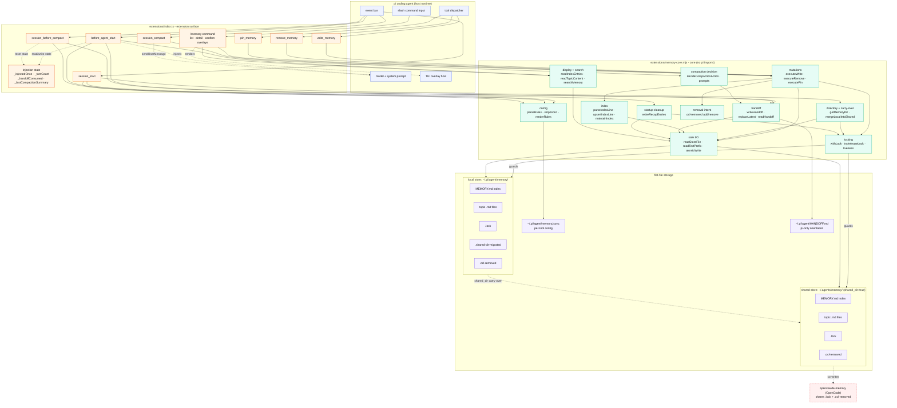
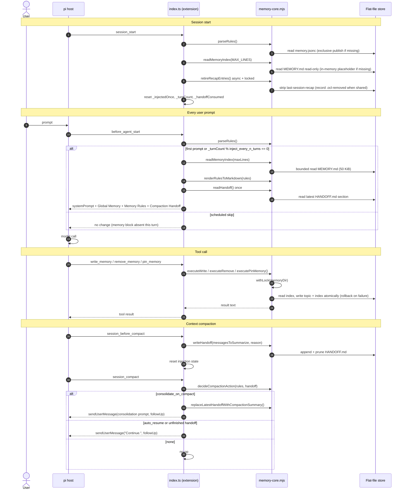
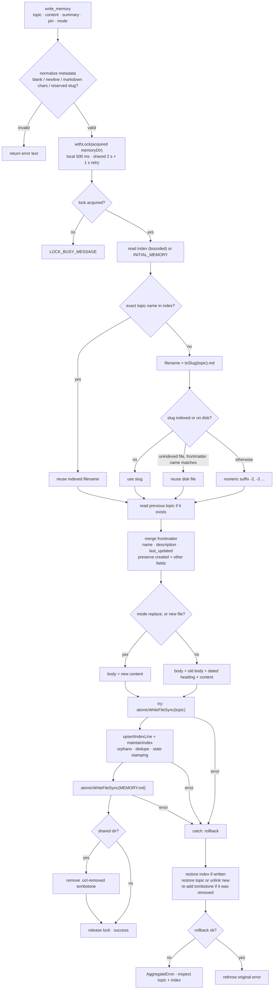
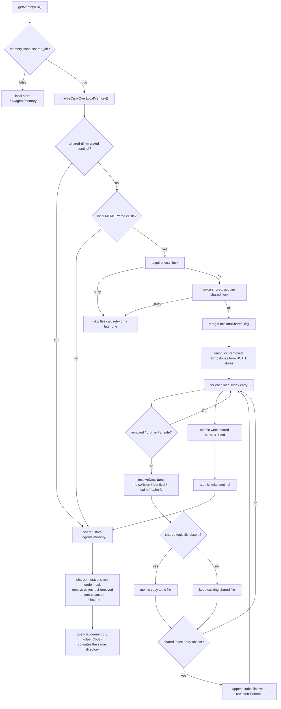
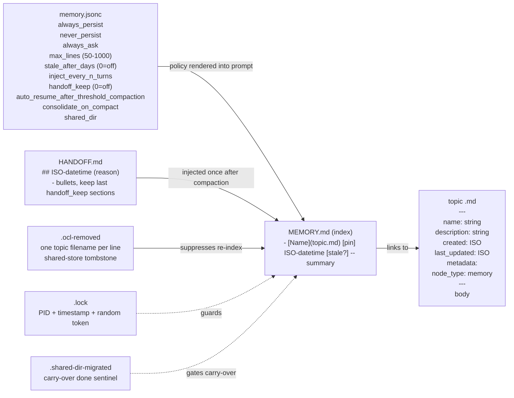

# Architecture & Internals

[← Back to README](../README.md)

## Architecture

This is a pi **extension** packaged as a **pi package** (keyword `pi-package`, installable via `pi install`). No build step — pi loads the TypeScript via jiti at runtime.

**Extension entry:** `extensions/index.ts`  
**Core logic:** `extensions/memory-core.mjs` (plain JS, no pi imports — independently testable)  
**Skill:** `skills/memory/SKILL.md`

Hooks used:

| Hook                     | Purpose                                                                                     |
| ------------------------ | ------------------------------------------------------------------------------------------- |
| `session_start`          | Read/create local config, read a missing index in memory, await locked recap retirement, and reset injection state |
| `before_agent_start`     | Inject `MEMORY.md` + rules + latest handoff entry into system prompt (once per user prompt) |
| `session_before_compact` | Write compaction handoff to `HANDOFF.md`; reset injection state so next prompt re-injects  |
| `session_compact`        | Auto-resume/consolidation after completed threshold compaction; handoff-aware fallback sends `"Continue."` only for explicit unfinished-work language |

`write_memory` also carries `promptSnippet` and `promptGuidelines` so the model always has a reminder to persist, even on turns where the full memory block is not injected.

`before_agent_start` returns a full `systemPrompt` replacement rather than patching pi's diffed `systemPromptOptions.sections`. On pi `>=0.87` this is a whole-prompt cache miss whenever the memory block re-injects (every `injectEveryNTurns`); non-injected turns keep pi's normal cached prompt. Pi still recommends the sections route (unchanged through `1.0.0`), but memory is free-form text that changes across sessions, so this cost is accepted for simplicity.

Mutations capture the directory acquired by `withLock` and retain it across config changes. Local contention refuses after about 500 ms; shared mode waits about 2 s and retries once after a 1 s delay. Startup recap retirement is async and locked; missing-index reads never create an index. Migration acquires local then shared, respects both removal lists, and marks success only after completion. Lock liveness treats `EPERM` as alive and stale reclaim rechecks inode/mtime.

Mutation reads verify no-follow regular-file descriptors; preview/search reads are bounded to 50 KiB after opening. Nonblocking open refuses FIFOs without hanging. Config reads permit trusted symlink targets but still require regular descriptors; exclusive config publication preserves racing creators and existing backups. Writes flush exclusive temporary files, publish by rename, and clean temporary files. Normal write failures attempt topic/index rollback; shared removals record intent before dropping discoverability. A new topic reuses an unindexed file only when its frontmatter name matches, otherwise it gets a free numeric suffix. Both write modes refresh current name/description/timestamp metadata, preserving creation and other fields.

Atomicity is per file. Abrupt termination can leave unindexed topics or stale index metadata; directories are not fsynced. The advisory lock has no atomic compare-and-unlink primitive and assumes cooperating same-user writers on local filesystems. Update both implementations before relying on coordinated shared storage.

## System architecture

These diagrams are derived from the current source (`extensions/index.ts`, `extensions/memory-core.mjs`) and the on-disk store layout.

### Component map

End-to-end component view: the pi host dispatches into the extension surface (`index.ts`), which delegates to the pi-free core (`memory-core.mjs`), which reads and writes the flat-file stores under cross-process locks.



### Session lifecycle and injection

Ordered flow across the four hooks: startup bootstrap, per-prompt scheduled injection, tool mutations, and compaction handoff / auto-resume.



### Mutation / write path

`executeWriteMemory` from validation through slug resolution, atomic topic + index writes, and per-file rollback on failure.



### `shared_dir` carry-over and cross-tool coordination

One-time local-to-shared migration and the shared-store conventions (`.lock`, `.ocl-removed`) shared with openclaude-memory on OpenCode.



### Store data model

The on-disk artifacts and how config policy, handoff, tombstones, and the lock relate to the `MEMORY.md` index.



## Model compatibility

The extension injects markdown and registers validated tools. Storage safeguards are independent of model size; automatic persistence and factual quality are model decisions. The tables below are usage estimates, not benchmarks or guarantees for particular models.

| Feature                                   | Large (20B+)         | Small-Mid (>7B <20B) | Compact (<7B)        |
| ----------------------------------------- | -------------------- | -------------------- | -------------------- |
| `/memory` show index                      | Reliable             | Reliable             | Reliable             |
| `/memory <text>` store via `write_memory` | Reliable             | Reliable             | Reliable             |
| `/memory pin/unpin/remove`                | Reliable             | Reliable             | Reliable             |
| Auto-trigger writes (persist rules)       | Reliable             | Reliable             | Usually works        |
| Topic/summary quality on auto-writes      | Reliable             | Reliable             | Usually works        |
| `[stale?]` flagging and self-healing      | Extension-guaranteed | Extension-guaranteed | Extension-guaranteed |

For compact or edge models, `/memory <text>` explicit commands are always more reliable than relying on auto-trigger writes.

## Token overhead

Estimates use cl100k-compatible tokenization (~4 chars/token for English prose, ~3 chars/token for paths and datetime strings). All figures are approximate.

### Per-turn base — always present

`write_memory`'s `promptSnippet` and three `promptGuidelines` bullets are injected into the system prompt on **every turn**, regardless of `inject_every_n_turns`:

| Component                                      | ~Tokens  |
| ---------------------------------------------- | -------- |
| Tool snippet ("Persist facts, preferences…")  | 20       |
| Guideline: when to call write_memory           | 47       |
| Guideline: check Memory Rules                  | 25       |
| Guideline: mode replace vs append              | 37       |
| **Per-turn base**                              | **~130** |

### Injection cost — added on injected turns

| Component                                               | ~Tokens  |
| ------------------------------------------------------- | -------- |
| `## Global Memory` heading, preamble, memory dir path   | 59       |
| `## Memory Rules` heading, preamble, memory.jsonc path   | 45       |
| Default rules content (3 sections, 11 bullets)          | 157      |
| `# Memory Index` header                                 | 4        |
| **Fixed injection overhead**                            | **~265** |
| Per index entry (name, filename, ISO datetime, summary) | ~35      |

The per-entry cost is for a typical line with a full ISO datetime stamp and a one-sentence summary. Pinned or stale entries add ~2–3 tokens each.

### Compaction handoff cost — first post-compaction turn only

The handoff entry is injected exactly once — on the first prompt after a compaction event — then suppressed for the remainder of the session.

| Component                                                      | ~Tokens  |
| -------------------------------------------------------------- | -------- |
| `## Compaction Handoff` heading + 2-line preamble              | ~30      |
| Entry header (`## ISO datetime (reason)`)                      | ~15      |
| Bullet content — typical (5–8 bullets)                         | ~70      |
| Bullet content — maximum (15 bullets cap)                      | ~180     |
| **Typical handoff overhead**                                   | **~115** |
| **Maximum handoff overhead**                                   | **~225** |

Set `"handoff_keep": 0` in `memory.jsonc` to disable entirely.

### Auto-resume nudge cost

| Component             | ~Tokens |
| --------------------- | ------- |
| `"Continue."` message | 2       |

Negligible. Only fires on threshold compaction — not overflow or manual.

### Total per injected turn

| Scenario               | Entries | Injection | Always | **Total**  |
| ---------------------- | ------- | --------- | ------ | ---------- |
| Fresh install          | 0       | ~265      | ~130   | **~395**   |
| Normal use             | 10      | ~615      | ~130   | **~745**   |
| Active use             | 25      | ~1,140    | ~130   | **~1,270** |
| Fully loaded           | 50      | ~2,015    | ~130   | **~2,145** |
| At `max_lines: 300` cap | ~297   | ~10,660   | ~130   | **~10,790** |

With `inject_every_n_turns: 5` (default), the amortized cost per turn is `(injection + 4 × base) ÷ 5`:

| Scenario                  | Amortized/turn |
| ------------------------- | -------------- |
| Normal use (10 entries)   | **~253**       |
| Fully loaded (50 entries) | **~533**       |
| At cap (297 entries)      | **~2,256**     |

Non-injected turns cost only the per-turn base: **~130 tokens**.

For context: 10,790 tokens is ~5.4% of a 200k context window. A 50-entry index stays well under 2,200 tokens per injected turn.

### Savings from throttling

**Default `inject_every_n_turns: 5` over a 20-turn session** (injects at turns 1, 5, 10, 15, 20 — 5 injections, 15 skipped):

| Index size | N=1 total (baseline) | N=5 total | Tokens saved | % saved |
| ---------- | -------------------- | --------- | ------------ | ------- |
| 10 entries | ~14,900              | ~5,675    | **~9,225**   | 62%     |
| 20 entries | ~22,700              | ~7,825    | **~14,875**  | 66%     |
| 30 entries | ~28,900              | ~9,175    | **~19,725**  | 68%     |

**Effect of different N values — 20-turn read-heavy session, 10-entry index:**

| `inject_every_n_turns` | Injections / 20 turns | Session total | vs N=1     | Saved   |
| ---------------------- | --------------------- | ------------- | ---------- | ------- |
| 1 (every turn)         | 20                    | ~14,900       | —          | —       |
| 3                      | 7                     | ~6,905        | ~7,995     | 54%     |
| **5 (default)**        | **5**                 | **~5,675**    | **~9,225** | **62%** |
| 10                     | 3                     | ~4,445        | ~10,455    | 70%     |
| 20                     | 2                     | ~3,830        | ~11,070    | 74%     |

Higher N saves more tokens but increases the gap between memory rule refreshes. For read-heavy sessions, N = 10–20 is reasonable. For write-heavy sessions where the agent actively stores new entries, keep N at 5 or lower so the rules stay recent in context.

## Development

```bash
# Run both smoke suites (core logic + host-load extension wiring)
npm test

# Core logic smoke tests only (no install required — plain node, no pi imports)
node tests/core.test.mjs

# Host-load smoke test (requires npm install — imports @earendil-works/pi-coding-agent)
node tests/extension.test.mjs

# Type-check against the pinned pi baseline
npm run typecheck

# Load extension temporarily without installing
pi -e ./extensions/index.ts
```

Current verification: 134 core checks, 12 real pi-loader checks, and typecheck on pi 0.99.1 and pi 1.0.0 (the lockfile/CI dev baseline is 1.0.0). From an OpenCode sibling checkout, `node tests/shared-store-test.mjs /absolute/path/to/openpi-memory/extensions/memory-core.mjs` also checks parallel real-process writes, pins, removals, foreign entries, and cleanup in temporary storage. Interactive rendering and model decisions are separate from these loader/storage checks.
